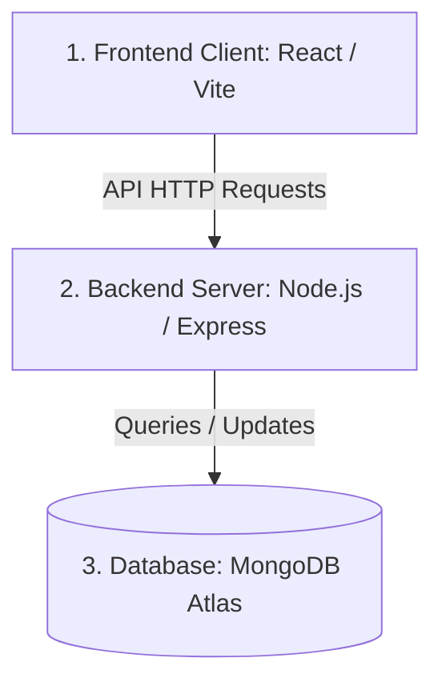

# 🎓 Final Project Presentation & Exam Study Guide

This guide breaks down your portfolio website in simple terms so you can confidently answer any questions from your lecturer.

---

## 1. High-Level Architecture (The Big Picture)

Your website is a **Full-Stack MERN-like application** (React, Express, Node, MongoDB). It has three main layers:



1. **Frontend (Client):** The interface the user sees. Built with **React** and styled using **Vanilla CSS**.
2. **Backend (Server):** The engine running in the background. Built with **Node.js** and **Express**. It handles requests and contains logic.
3. **Database (MongoDB Atlas):** A cloud database where your projects, skills, education, experience, and contact messages are stored.

---

## 2. The Frontend (Client)

### Key Technologies
- **React:** For building reusable UI components.
- **Vite:** A build tool that runs your local development server fast.
- **React Router (`react-router-dom`):** Handles page navigation. Your site is a single-page app for visitors, but has a separate `/admin` route for you.
- **Lucide React:** Icon pack for clean, modern icons.

### Critical Concepts for the Exam
*   **State (`useState`):** Variables that, when changed, automatically redraw (re-render) parts of the page. For example, loading state, form input values, list of projects.
*   **Effects (`useEffect`):** Functions that run automatically. You use this to fetch data from your backend API as soon as a page loads.
*   **React Portals (`createPortal`):** Used to render the project detail popup modal directly onto the HTML `<body>` element instead of deep inside the project section. This fixes overlapping visual bugs.

---

## 3. The Backend (Server)

### Key Technologies
- **Node.js:** The environment that lets JavaScript run on a computer/server.
- **Express.js:** A framework for Node that makes it easy to handle HTTP requests (GET, POST, PUT, DELETE).
- **Mongoose:** A library that connects your Node server to MongoDB and makes it easy to read/write database items using "Schemas" (models).

### How the Code is Structured (MVC Pattern)
*   **`server.js`:** The entry point. Loads configurations, connects to the database, and starts the server.
*   **`app.js`:** Sets up middleware (like CORS to allow requests and JSON parser) and routes.
*   **Models (in `models/`):** Defines the structure of your data (e.g., Project.js dictates that a project must have a `title`, `description`, etc.).
*   **Controllers (in `controllers/`):** The logic. Functions like `getProjects` (fetch from DB) or `createProject` (save to DB).
*   **Routes (in `routes/`):** Links URLs to controller functions (e.g., a `POST` request to `/api/messages` triggers `createMessage`).
*   **Middleware (in `middleware/auth.js`):** Intercepts requests. `protectAdmin` checks if the request header contains the correct `x-admin-key` secret password before allowing changes.

---

## 4. Top Lecturer Questions & Perfect Answers

### Q1: "How does the frontend communicate with the backend?"
> **Answer:** "The frontend uses JavaScript's built-in `fetch` function to send HTTP requests to the backend API endpoints (e.g., `https://dbje835narh8b.cloudfront.net/api/projects`). The backend processes the request, talks to MongoDB, and sends back data in JSON format, which the React client receives and displays using state."

### Q2: "How is your Admin page secured?"
> **Answer:** "The Admin page is secured in two places:
> 1. **On the Frontend:** A React state variable checks `localStorage` for a secret key. If not present, it renders a login gate.
> 2. **On the Backend (API Level):** Admin endpoints (POST, PUT, DELETE) use a middleware called `protectAdmin`. When an admin tries to create or edit a project, the client sends the key in the request headers under `x-admin-key`. The server compares this key with the `ADMIN_SECRET_KEY` stored in its private `.env` environment variables. If it matches, the action proceeds; if not, the server rejects it with a `401 Unauthorized` status."

### Q3: "What is Mongoose and why did you use it?"
> **Answer:** "Mongoose is an ODM (Object Document Mapper) for MongoDB. We use it to connect our Express backend to the MongoDB database. It allows us to define strict schemas (models) for our collections (like Projects, Skills, Messages) so we can ensure data consistency, execute queries easily, and write clean asynchronous database logic."

### Q4: "What is CORS and why did you configure it?"
> **Answer:** "CORS stands for Cross-Origin Resource Sharing. By default, browsers block websites from making API requests to a server on a different domain/port. Because our React frontend runs on one server (e.g., port 5173 or S3 hosting) and the backend runs on another, we used the `cors` middleware in our Express server to authorize cross-origin requests."

### Q5: "If your backend server crashes or DB is disconnected, what happens?"
> **Answer:** "In our database configuration, we wrapped the connection logic in a `try-catch` block. If connection fails, the server prints the error and executes `process.exit(1)` to stop the application safely rather than running in an unstable state. On the frontend, if the API call fails, we catch the error and set an error state, displaying a user-friendly alert box telling the user that the backend is currently offline."

### Q6: "Why did you use a .env file?"
> **Answer:** "We use a `.env` file to store environment-specific configurations and sensitive credentials, such as the MongoDB connection string (database password) and the Admin secret key. This prevents us from hardcoding secrets in our codebase, and we add `.env` to our `.gitignore` file so these credentials are never pushed to GitHub."

### Q7: "Why are some project images loaded from URLs (Unsplash) while the SongKherm image is loaded from a local public folder?"
> **Answer:** "For the Gym and SaveEat projects, I used high-quality images hosted on a global CDN (Unsplash). This is a production best practice because it speeds up global loading times and keeps the code repository small. For the SongKherm project, I wanted to showcase my actual custom logo. Since it's a unique custom asset, storing it locally in the React `/public` directory ensures it gets compiled and hosted directly with my frontend website code."

---

## 5. How to Run the Project & Push to Git (Cheat Sheet)

### How to Run the Project Locally
If you close your computer and need to start the website locally again:
1. Open your terminal (e.g., Command Prompt, PowerShell, or VS Code terminal).
2. Navigate to the project root directory:
   ```bash
   cd "d:\Final Portfolio Website"
   ```
3. Start both the client and the server with one command:
   ```bash
   npm run dev
   ```
4. Open your browser and go to:
   *   **Website Frontend:** `http://localhost:5173`
   *   **Backend Server/API:** `http://localhost:5000`

### How to Push Your Code to Git (Safely)
Whenever you make new changes to your files and want to save them on GitHub:
1. Open a terminal in the root folder (`d:\Final Portfolio Website`).
2. Pull the latest code online first (to prevent conflicts):
   ```bash
   git pull origin main
   ```
3. Stage all your new local changes:
   ```bash
   git add .
   ```
4. Commit the changes with a short descriptive note:
   ```bash
   git commit -m "Your description of what you changed"
   ```
5. Push the code online:
   ```bash
   git push origin main
   ```
